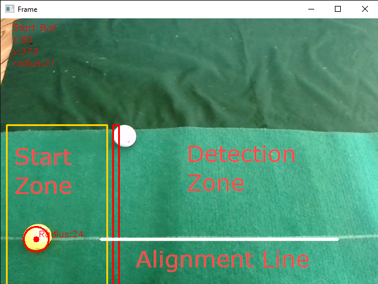

# Prototype for Webcam based putting simulation for GSPRO utilizing the R10 connect package
Forked from travislang to include integration into cam-putting-py to send putting shots to GSPRO

Standalone version of the putting simulator can be found here:

https://github.com/alleexx/cam-putting-py

Calculation includes BallSpeed in MPH and HLA of the putt. 

Setup:

- Unpack the [release](https://github.com/alleexx/gspro-garmin-connect-v2/releases) and execute "gspro-garmin-connect-v2-putting.exe"
- Position Webcam on the side and above the putting start area across from you - see video for example
- Position the Ball (choose the right color or use calibrate as described below.) on a dark green surface - In my test the area visible to the webcam was about 60 - 80 centimeters high and across from me
- Adjust your webcam to the white line to reflect a straight put and place your ball into the yellow rectangle.
- Once identified the ball should get a red circle fully around. If it is smaller or bigger than the ball it will not reflect the right putting speed. It must match the ball dimensions as best as it can.
- If the ball is not detected try adjusting the light situation or try a different ball color option (hit q to exit the putting simulator and start again with another Ball Color)
- The putt needs to cross the red rectangle and needs to leave on the other side
- If a shot is detected it is send to garmin connect app at http://localhost:8888/ where my extension of the garmin connect app is receiving the shot and passing it to GSPRO

Make sure to select the best ball color. White is a very general option if no color ball is availabe but might give you more false reads on other white objects. If you have use a colored ball.

Calibrate to the Ball Color:

You can start the putting sim mode with each ball color after one another and see if your putt is being picked up or you can use the calibrate option as ball color. This will record 30 seconds of video in which you should place the ball in the yellow rectangle wait for 5 seconds (the ball is not marked red in this option) and then putt. Try to get 2 putts recorded within the 30 seconds and it will automatically then run your recording through all color options available and give you an output with the highest detection rate number. You can then choose that color option.

This is early development so happy about feedback but do not base your SGT career on it

Software is open source. Feel Free to buy me a coffee or a sleeve of golf balls if you like it.

[](https://ko-fi.com/U6U2I70HX)



Here is a short video demonstration of the prototype

https://youtu.be/ZgcH25WkCWQ

## About the Original App from Travis below

Integrates the garmin R10 with the GSPro software.
This is open source software.

I am not responsible for what you do with it

If you find this useful I would appreciate you clicking the "star" button in the top right of this repo for me :)

## Usage

### Download the .zip file:

Go to the [releases page](https://github.com/travislang/gspro-garmin-connect-v2/releases)

Download the file `gspro-r10-connect.zip` from the assets sectionof the most recent release - currently `v1.3.5`

Extract the contents of the zip file and open the folder.  You will only need to use the `r10-connect.exe` file so you can add a shortcut to your desktop to make future access easier.

### Connect to GSPro:

Open GSPro.  Make sure the smaller GSPro Connect window opens.  If this is your first time running GSPro you will have to select the connect window option called `Open API v1` or something similar.  You won't have to do this in the future unless you change your LM.

Run the `r10-connect.exe` file from the previous step

Once it opens you will see an IP and port in the center of the main window:

```
IP Adrress: xxx.xxx.x.xx
Port: xxxx
```

You should also see on the left side that the program is connected to GSPro now with a green status light.

At this point you can open the driving range on GSPro and click the `Send Test Shot` button in this program and you should see the shot reflected in GSPro.


### Connect to R10:

Alright, now let's get our real shots into GSpro.

Open the Garmin golf app on your phone and press the `Play E6 connect` option. press the settings icon and make sure the IP and port match from the values in the program running on your PC.

Press the "Play on PC" button in your garmin app and you should notice on the right side that the program is now connected to the R10 with a green status light.

When both status lights are green it will say `Ready for shot` and you are good to go.

This app will intercept all shot data and forward it to GSPro while simulatiously responding to the garmin app to keep it connected.

## Troubleshooting

If the garmin app on your phone tells you that it has disconnected from E6 click the `reconnect` button and that usually will fix it.  If not then completely close out of the garmin app and reopen it.  Click the `continue session` button and you should get reconnected.  I never have to do anything on the PC for disconnect issues, only on my phone.

If you can't get the program to connect to the R10 make sure your phone is on the same wifi as your PC that is running GSPro.

Make sure your firewall settings are off on your PC or whitelist the port you are using because firewalls will usually block the connection.

If none of that works you may have to change the IP address the program is using to a different one.  To do this click the 'wrench' icon next to the IP number and it will open an options box.  If there is more than one IP address option click a different one and try the above steps with that one.
